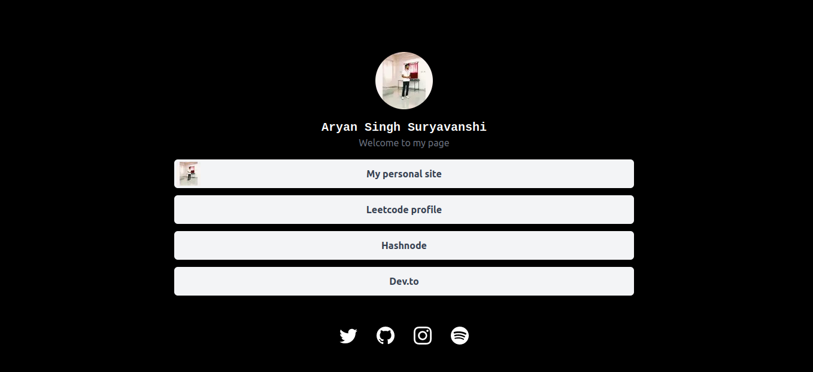

<a href="https://linker.pages.dev">
 
  <h1 align="center">Linker</h1>
</a>
 
<p align="center">
  An effortlessly simple link sharing app that lets you share all your links though a single page.
</p>



This is a dead simple link sharing application built using **NextJS** and **TailwindCSS**. This project aims to provide a starter template for an SPA to share all your links at one place.

I built it because I wanted a simple application to hold all my links so that I can share it to a potential recruiter or anyone in general easily. It had to be personalised and minimalistic too. 

Well using this as a template can be opiniated. Ostensibly, anyone could use an application like Linktree but creating something of my own felt more in my control. And also avoiding the troubles of sign up and login and tracing of data.

---
## Tech Stack

- [Next.js](https://nextjs.org/)
- [Tailwind CSS](https://tailwindcss.com/)
- [React-icons](https://react-icons.github.io/react-icons/)

## Development

First, clone the repository.

```bash  
git clone git@github.com:singharyan1007/linker.git
```

Then install the dependencies.

```bash
npm install
```

Finally, run the development server.

```bash
npm run dev
# or
yarn dev
# or
pnpm dev
```

Open [http://localhost:3000](http://localhost:3000) with your browser to see your Linker in action.

File structure which contains the components and CSS.
```
src/
┣ assets/
┃ ┗ Linkerdemo.png
┣ components/
┣ pages/
┃ ┣ api/
┃ ┃ ┗ hello.js
┃ ┣ _app.js
┃ ┣ _document.js
┃ ┗ index.js
┗ styles/
  ┗ globals.css
```
Make changes in the `data.json` file which contains the links to all your profiles. Finally if you want to add more links then follow the pattern as metioned in the `data.json` file. And do not forget to import the icons if you are adding more social links.

If you like the project please give it a star.

---

## License

MIT


> GitHub [@singharyan1007](https://github.com/singharyan1007) &nbsp;&middot;&nbsp;
> Twitter [@singharyan1007](https://twitter.com/singharyan1007)&nbsp;&middot;&nbsp;
> LinkedIn [@singharyan1007](https://www.linkedin.com/in/aryan-singh1007/)